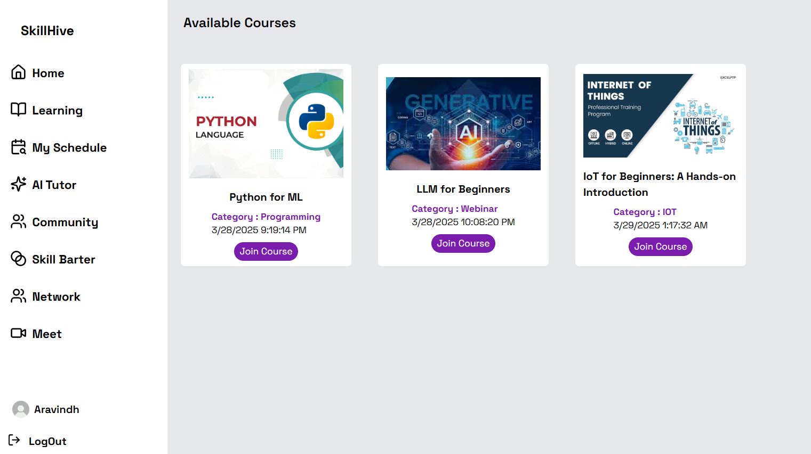

# SkillHive

SkillHive is a skill-sharing platform designed for instructors and learners to connect, share knowledge, and grow together. The platform provides tools for creating courses, registering for classes, and fostering a community of learning.

**Live Link**: [SkillHive](https://skillhive-three.vercel.app/)



## Features

- **For Instructors**:
  - Create and manage courses.
  - Share knowledge with a wide audience.
  - Track course registrations.

- **For Learners**:
  - Browse and register for courses.
  - Engage with instructors and peers.
  - Build skills with Barter Systems.
  - Join Intractive Quizes and collaborate with others.
  - Share feedback and reviews.

## Tech Stack

### Client
- **Frontend Framework**: React.js
- **Styling**: Tailwind CSS
- **HTTP Client**: Axios 
- **Deployment**: Vercel 


### Server
- **Backend Framework**: Node.js with Express.js
- **Database**: MongoDB
- **AI Features**: Custom AI models for quizzes and roadmaps.

## Installation

### Prerequisites
- Node.js and npm installed.
- MongoDB instance running.

### Steps
1. Clone the repository:
   ```bash
   git clone https://github.com/AravindhPrabu2005/Skill-Sharing-Platform
   cd skillhive
   ```
2. Install dependencies for both client and server:
   ```bash
   cd client
   npm install
   cd ../server
   npm install
   ```
3. Set up environment variables:
   - Copy `.env.example` files in both `client` and `server` directories to `.env`.
   - Update the `.env` files with your configuration.

4. Start the development servers:
   - Client:
     ```bash
     cd client
     npm start
     ```
   - Server:
     ```bash
     cd server
     npm start
     ```

5. Open the client in your browser at `http://localhost:3000`.

## Folder Structure

### Client
- `src/`: Contains React components, styles, and utilities.
- `public/`: Static assets like `index.html` and images.

### Server
- `LLM/`: AI models for quizzes and roadmaps.
- `models/`: Mongoose models for database schemas.
- `routes/`: API routes for the backend.

## API Endpoints

### Base URL
The client communicates with the server using the base URL defined in [`axiosInstance.js`](client/src/axiosInstance.js).

### Example Endpoints
- **Courses**: `/api/courses`
- **Users**: `/api/users`
- **Registrations**: `/api/registrations`

## Contributing

We welcome contributions! Please follow these steps:
1. Fork the repository.
2. Create a new branch for your feature or bugfix.
3. Submit a pull request with a detailed description of your changes.

## License

This project is licensed under the MIT License. See the [LICENSE](LICENSE) file for details.

## Contact

For questions or support, please contact us


